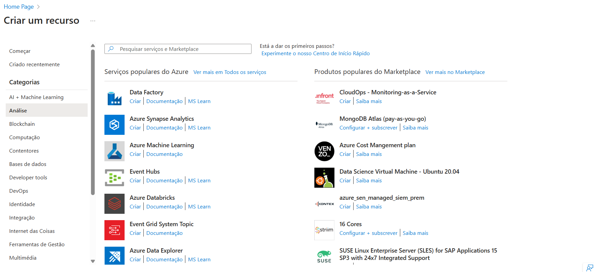
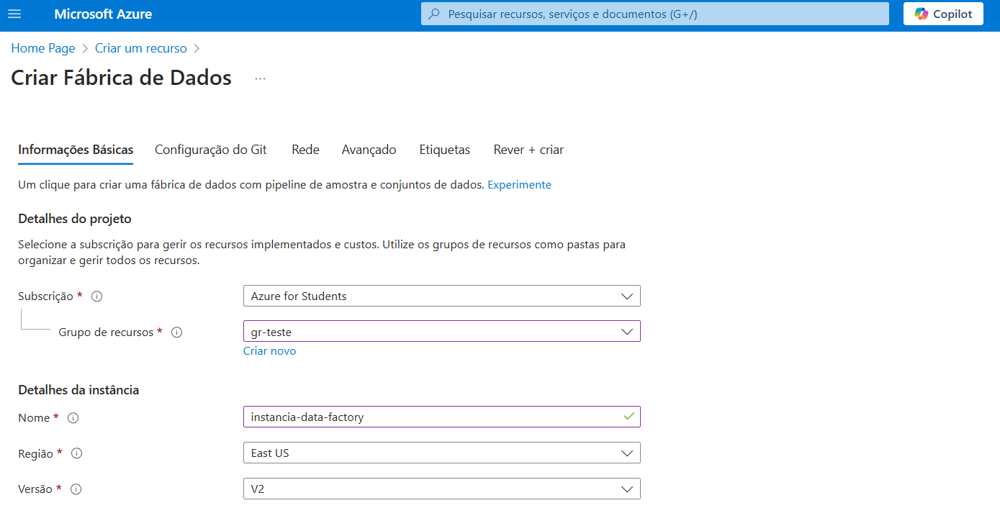

# 📘 Guia Azure Data Factory

Um guia moderno sobre o **Azure Data Factory**, uma das ferramentas mais completas para **ETL/ELT** e **integração de dados** na nuvem.  

---

## 🔹 O que é o Azure Data Factory?

De acordo com a Microsoft Learn:  

> "O Azure Data Factory é uma ferramenta na nuvem da Microsoft, criado para atender à projetos complexos de ETL/ELT,  integrando e transformando informações de várias fontes de forma automatizada."  
> — [Saiba mais no Microsoft Learn](https://learn.microsoft.com/pt-br/azure/data-factory/introduction)  

Resumidamente, o **Azure Data Factory** permite **mover, transformar e orquestrar dados** de diversas fontes, sendo uma solução robusta para pipelines de dados na **nuvem**.  

 

### 🛠️ Principais Recursos

- **Integração de Dados** 📡 → Conecte-se a mais de 90 fontes de dados.  
- **ETL/ELT na Nuvem** ☁️ → Transforme seus dados sem necessidade de infraestrutura local.  
- **Pipelines de Dados** 🔄 → Automação e orquestração eficiente de fluxos de trabalho.  
- **Monitoramento e Segurança** 🔐 → Controle de logs e permissões avançadas.  

---

## 🚀 Como começar?

### 🔹 1. Criando uma conta na Azure  
Para utilizar o **Azure Data Factory**, é necessário ter uma conta na **Azure**, a plataforma de nuvem da Microsoft. Você pode criar uma conta gratuita diretamente pelo portal:  

🔗 [Criar conta gratuita no Portal da Azure](https://portal.azure.com)  

Se você é estudante, pode se inscrever no **Azure for Students** e ganhar **100 dólares de crédito** para usar durante **um ano**:  

🎓 [Acesse o Azure for Students](https://azure.microsoft.com/pt-br/free/students)  

---

## 🧪 Criando um Pipeline de ETL no Azure Data Factory (End-to-End)

Nesta seção, vamos construir um pipeline completo no **Azure Data Factory (ADF)**. Ele irá:

✅ Conectar-se a um banco de dados **Azure SQL Database**  
✅ Extrair dados de uma tabela  
✅ Armazenar os dados em um **Azure Data Lake Storage Gen2**  
✅ Automatizar o processo com orquestração e monitoramento  

### 📌 Pré-requisitos

Antes de começar, você deve ter:

- ✅ Uma conta no [Portal da Azure](https://portal.azure.com)
- ✅ Um **Azure SQL Database** com uma tabela de teste
- ✅ Um **Azure Data Lake Storage Gen2** configurado
- ✅ Permissões para criar recursos no Azure Data Factory

### 🚧 Etapa 1: Criar uma instância do Azure Data Factory

1. Acesse o [Portal da Azure](https://portal.azure.com)
2. Procure por **"Data Factory"**
3. Clique em **Criar**
4. Preencha os campos:
   - Nome: `instancia-data-factory`
   - Região: East US
   - Grupo de recursos: selecione um existente ou crie um novo
5. Clique em **Revisar + criar** e depois em **Criar**

#### 📸 Visão da interface no portal

  
  &nbsp;&nbsp;&nbsp;
  

### 🔌 Etapa 2: Criar Linked Services (Conexões)

#### 🔹 Azure SQL Database

1. No menu lateral esquerdo, vá em **Manage (Gerenciar)** > **Linked services**
2. Clique em **New**
3. Escolha **Azure SQL Database**
4. Preencha as credenciais (servidor, banco, usuário, senha)
5. Teste a conexão e salve

#### 🔹 Azure Data Lake Gen2

1. Crie outro **Linked service**
2. Escolha **Azure Data Lake Storage Gen2**
3. Selecione o método de autenticação (por conta de armazenamento ou Key Vault)
4. Informe o caminho do container e teste a conexão

### 📁 Etapa 3: Criar Datasets

1. Vá em **Author (Autor)** > **Datasets**
2. Crie um novo dataset para:
   - 📤 **Origem**: selecione o **Azure SQL Database** e a tabela desejada
   - 📥 **Destino**: selecione o **Data Lake Gen2** e configure o caminho do arquivo (por exemplo, `/raw/tabelaX.csv`)

### 🔄 Etapa 4: Criar um Pipeline

1. Vá em **Author** > **Pipelines** > **New pipeline**
2. Dê um nome ao pipeline: `etl_sql_to_datalake`
3. Arraste um componente **Copy Data** para o canvas
4. Clique no componente e configure:
   - **Source**: seu dataset do SQL
   - **Sink**: seu dataset do Data Lake
5. (Opcional) Adicione **atividades adicionais**:
   - `Wait` → Para aguardar processos
   - `If Condition` → Para validar condições
   - `Execute Data Flow` → Para transformar dados

### ⏱️ Etapa 5: Orquestrar e Monitorar

1. No topo da tela, clique em **Debug** para testar
2. Clique em **Add Trigger** > **New/Edit**
   - Configure uma **trigger agendada**, por exemplo, a cada hora ou diariamente
3. Após publicado, vá em **Monitor** para acompanhar as execuções

### 📦 Resultado

Ao final, você terá um pipeline que:
- Conecta ao seu banco SQL
- Copia dados de uma tabela
- Salva os dados no Data Lake em formato `.csv` ou `.parquet`
- Roda automaticamente conforme o agendamento

### 📘 Dica extra

Você pode usar [Data Flows](https://learn.microsoft.com/pt-br/azure/data-factory/concepts-data-flow-overview) para transformar dados antes de armazená-los no Data Lake.  
Com ele, é possível aplicar transformações visuais como:
- Filtrar registros
- Renomear e reformatar colunas
- Fazer junções entre tabelas
- Agregar e ordenar dados
- Criar colunas derivadas

Os Data Flows são ideais para preparar dados sem precisar escrever código, usando uma interface visual dentro do próprio Azure Data Factory.

### ✅ Conclusão

Esse pipeline é uma base para projetos mais complexos de ETL. A partir dele, você pode incluir:
- Validação de dados
- Controle de qualidade
- Integração com Power BI
- Automatização com Logic Apps

---

## 📌 Links úteis

🔹 [Documentação Oficial](https://learn.microsoft.com/pt-br/azure/data-factory/)  
🔹 [Tutoriais Microsoft Learn](https://learn.microsoft.com/pt-br/training/paths/get-started-azure-data-factory/)  
🔹 [Portal da Azure](https://portal.azure.com)
🔹 [Azure for Students](https://azure.microsoft.com/pt-br/free/students)

---

## 📢 Contribua!

Se você tiver sugestões, melhorias ou quiser contribuir com o projeto, fique à vontade para abrir uma **issue** ou enviar um **pull request**! 😃  

